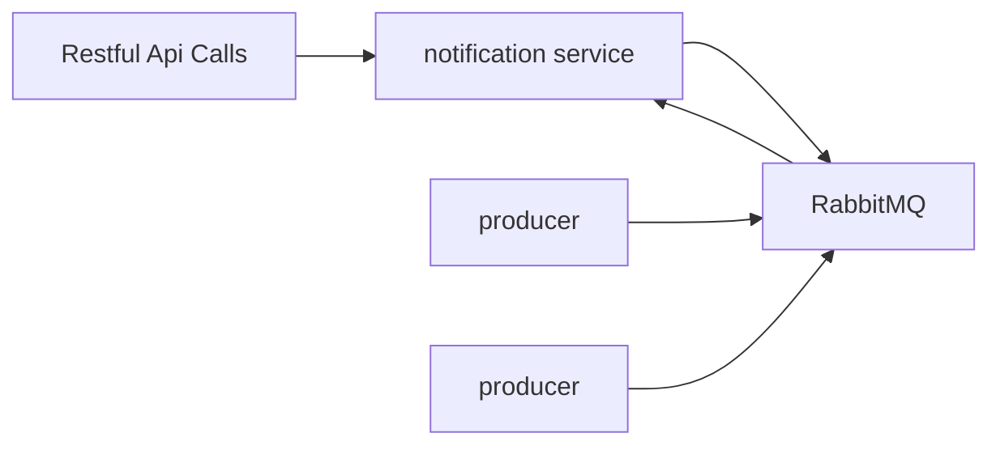

# Notification Service

Notification service is a **generic microservice** that can be used through a **messaging broker** or through **restful
api** calls to send email notifications.



It exposes two main end points to send simple and mime messages.

- **POST** /email/send/simple-email

```text
REQUEST BODY:
```
```json
{
  "emailTo": [
    "abc@xyz.com"
  ],
  "cc": [
    "abc@xyz.com"
  ],
  "bcc": [
    "abc@xyz.com"
  ],
  "subject": "Test subject",
  "message": "This is email for two recipients"
}
```

```text
RESPONSE BODY:
```
```json
{
  "emailTo": [
    "abc@xyz.com"
  ],
  "cc": [
    "abc@xyz.com"
  ],
  "bcc": [
    "abc@xyz.com"
  ],
  "subject": "Test subject",
  "message": "This is email for two recipients"
}
```

- **POST** /email/send/email-with-attachment
```text
REQUEST BODY: a multipart/formdata
```
```
  emailTo   : abc@xyz.com
  cc        : abc@xyz.com
  bcc       : abc@xyz.com
  subject   : Test subject
  message   : <html></html>
  attachments;
```
```text
RESPONSE BODY:
```
```json
{
  "emailTo": [
    "abc@xyz.com"
  ],
  "cc": [
    "abc@xyz.com"
  ],
  "bcc": [
    "abc@xyz.com"
  ],
  "subject": "Test subject",
  "message": "This is email for two recipients",
  "attachments": [
    "file1.pdf", "file2.pdf"
  ]
}
```
Also, it listens to the following main Queues within a broker (RabbitMQ) to send notification

- ORDER_CONFIRMATION_QUEUE
- ORDER_CANCELLATIONS_QUEUE
- PAYMENT_CONFIRMATION_QUEUE
- SHIPMENT_CONFIRMATION_QUEUE
- PROMOTIONAL_NOTIFICATION_QUEUE
- ACCOUNT_ACTIVATION_QUEUE

## screenshots
#### sample Order Confirmation Notification


#### RabbitMQ Dashboard listing some of the queues


## Features

#### A) Scheduled Notifications

This service can be configured to periodically send notification using cron commands.

#### B) Event Driven Notification

Through the broker, the service is reactive and sends notifications whenever an email object is available within
respective queues.

#### C) Compatibility with Most Systems

This service can be used with any other existing systems through a message broker (RabbitMQ) as an intermediary.

## installation steps

Docker is required to spin up an instance of a RabbitMQ instance. This option is applicable when one has no access to
any other
instance of RabbitMQ elsewhere, eg from cloud.

#### A) install RabbitMQ

To create an istance of RabbitMQ, run the following command after installing docker.

```shell
docker run -d --rm -p 15672:15672 -p 5672:5672 rabbitmq:3-management
```

#### B) Validate RabbitMQ

To validate if rabbitMq was correctly installed, run either of the two commands:

```shell
docker ps
```

```shell
docker container ls
```

Run either of the commands above will list docker containers running on your system. You should see one record with
an image called "rabbitmq:3-management" if the installation was successful. Click here ([RabbitMq Dashboard](http://127.0.0.1:15672)) to view your rabbitMQ dashboard.


#### C) Run the application

Once rabbitMQ is running, run the application using the following command.
To successfully use the code below, you must have an email, and its password.

If you don't know, research how to generate an email's password to use with the application:

```shell
./mvnw -DEMAIL=abc@xyz.com -DPASSWORD=password -DRABBITMQ_HOST=localhost -DRABBITMQ_PORT=5672 spring-boot:run 
```

## Technologies used

The following technologies were used:

- **Java 11+**
- **Spring Boot**
- **Maven Build Tool**
- **RabbitMq**
- **Docker**
